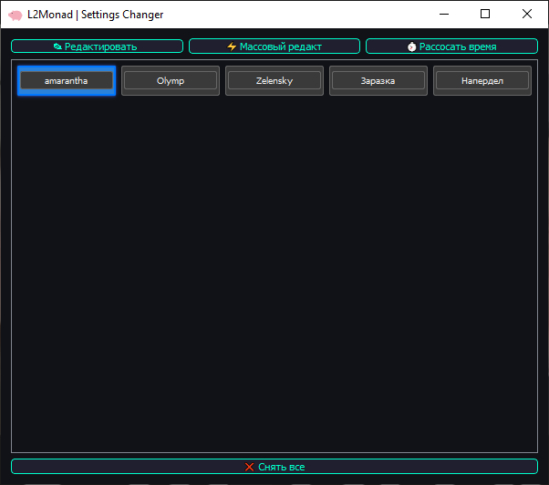
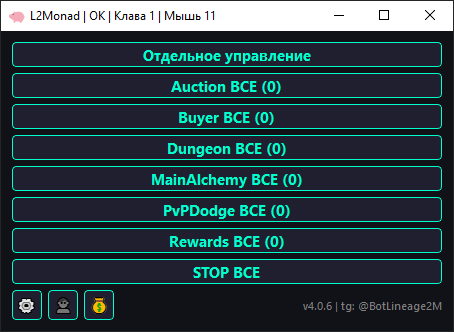
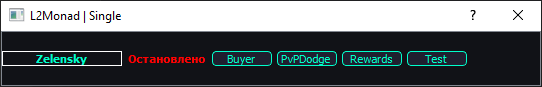
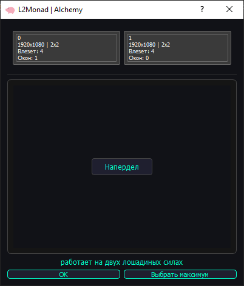
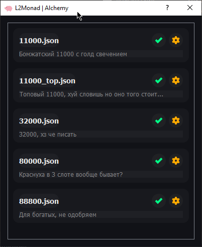
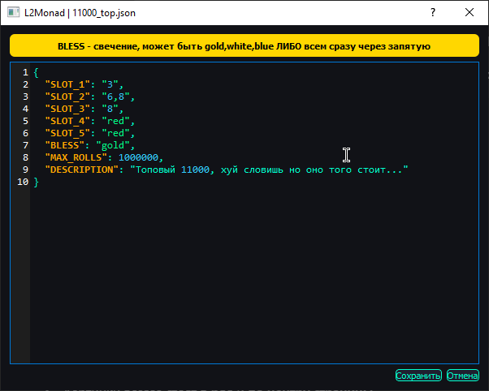

# 🧠 L2Monad -- Асинхронный многозадачный бот для Lineage2M

> **Актуально на:** 12.12.2025  
> Поддерживаемые регионы: **JP / RU**  
> **Бот бесплатный и полностью open-source.**

---

## 📺 Обзор

<p align="center">
  Видеогайды и демонстрации СКОРО появятся на канале -- подписывайся заранее!
</p>

<p align="center">
  <a href="https://www.youtube.com/@evyshape" target="_blank">
    
  </a>
</p>

<p align="center"><sub>(нажми на кнопку выше)</sub></p>

---

## 📥 Установка

1. ⬇️ Скачайте архив из репозитория (**Code → Download ZIP**) и распакуйте.  
2. ▶️ В папке `installer` кликните правой кнопкой на `installer.exe` → **Запустить от имени администратора**.  
3. ⏳ Дождитесь установки, убедитесь в отсутствии ошибок.  
4. 🔄 Перезагрузите ПК и переходите к настройке.

---

## 🤖 Настройка Telegram-бота

1. В папке проекта откройте `tg.ini`.
2. Активируйте или отключите Telegram-интеграцию:
   - `state = True` -- включить уведомления и управление окнами через Telegram.  
   - `state = False` -- отключить.

👉 Если бот **включён**:

3. Получите токен у [@BotFather](https://t.me/botfather) (`/newbot`)  
   -- вставьте его в `token = ВАШ_ТОКЕН`  
   ⚠️ **Не передавайте токен третьим лицам!**  
   Для каждого ПК используйте **отдельного бота**.

4. Получите свой Telegram ID у [@raw_info_bot](https://t.me/raw_info_bot) → `/start`  
   -- вставьте его в `admins = 123123`.  
   Несколько админов: `admins = 123,456`

5. ✅ Основная команда: **/menu**

---

## ⚙ Настройка основного бота

1. 📂 Запустите `start.bat` -- появится удобный GUI.
2. Нажмите по кнопке `👤` слева снизу, прокликайте все окна которые должны работать (это одноразово и сохраняется локально)
3. После первого запуска любого профиля в папке `settings` создаются JSON-файлы с конфигурацией каждого окна.  
4. Настройте их вручную или через GUI (шестерня слева снизу).

Пример конфига:

```json
{
    "REGION": "JP", // Регион игры: JP или RU
    "PEACE_MODE": true, // Мирный режим включен/выключен
    "PVP_EVADE": true, // Уворот от PVP (не может быть включен одновременно с PVP_ANSWER)
    "PVP_ANSWER": false, // Ответное PVP (не может быть включен одновременно с PVP_EVADE)
    "LOW_HP_DODGE": true, // Уход на лоу хп
    "HEALTH_BACK": [20, 30, 40], // Процент хп при котором будем улетать в город, лучше указывайте несколько (10.. 20.. 60.. 90..)
    "HP_BANK_CHECKER": true, // Проверка хп банок (если 0, бот телепортируется в город для закупки)
    "SOSKA_CHECKER": false, // Проверка сосок (аналогично HP банкам)
    "DEATH_CHECKER": true, // Следит за смертями, воскрешает погибшие окна и возвращает на спот
    "OVERWEIGHT_CHECKER": true, // Чекер перевеса
    "OVERWEIGHT_AFK": 80, // Порог перевеса для телепорта в город (0, 50 или 80)
    "SCHEDULE_BUYING": "10:30|13:30|20:20", // Время телепорта в город для закупки
    "SCHEDULE_MAIL": "10:00|15:00|20:00|05:00", // Время сбора почты
    "SCHEDULE_REWARDS": "21:03", // Время сбора всех наград
    "SCHEDULE_SCHEDULE": "", // Время включения игрового календаря
    "SCHEDULE_AUCTION": "", // Время перевыставления аукциона
    "SCHEDULE_PARTY_DUNGEON": "", // Время прохода пати данжа
    "PARTY_DUNGEON_HARD": 0, // Сложность пати данжа, от 1 до 4
    "DONATE_SHOP_PAGES": "1|2", // Страницы донат шопа для выкупа
    "ALLIANCE_BUTTON": 0, // Кнопка для доната в альянс, 0 = не донатим
    "SPOT_OT": 1, // Выбор спота для телепорта (от)
    "SPOT_DO": 1, // Выбор спота для телепорта (до)
    "TELEGRAM_NOTIFIES": true // Включение уведомлений в тг для этого окна
}

```

💡 **Советы:**  
- Для отключения событий `SCHEDULE_*` оставляйте пустые кавычки.  
- `SPOT_OT` и `SPOT_DO` -- диапазон спотов для рандомного выбора.  
- ⚙ Настройки доступны и через интерфейс -- нажмите **шестерню** в левом нижнем углу GUI.
<p align="center">
  
</p>

---

## ▶️ Запуск

1. Убедитесь, что Telegram-бот и профили настроены.  
2. Запустите `start.bat` -- появится главное окно управления:

<p align="center">
  
</p>

**Кнопки:**  
- **Отдельное управление** -- управление каждым окном по отдельности.  
- **Профиль ВСЕ** -- запуск выбранного профиля на всех выключенных окнах.  
- **STOP ВСЕ** -- останавливает все активные профили.

📌 Пример отдельного управления:

<p align="center">
  
</p>

> В прямоугольнике -- ник окна.  
> Кнопки справа запускают профиль только для этого окна (или через Telegram).

---

## 📂 Профили

В комплекте 6 базовых профилей:

1. **Buyer** 🛒 -- закупка расходки, возврат на спот.  
2. **Rewards** 🎁 -- сбор бп, донат в клан, донат в альянс, сбор почты, сбор дейли, сбор ачив, выкуп шопа
3. **PvpDodger** ⚔️ -- универсальный профиль (95% времени работы).  
   - Проверяет автоохоту и активирует при необходимости.  
   - Следит за состоянием окна и выполняет действия по конфигу.  
4. **Auction** 💰 -- перевыставление аукциона.  
5. **MainAlchemy** 🍾 -- крутка алхимки, о ней ниже.
6. **Dungeon** 🏰 -- пробегает пати данжик и возвращает окно на спот.

---

## 🍾 Алхимия

🎥 Видео работы: [Клик](https://t.me/BotLineage2M/35)

- Работает просто и понятно.  
- Для одновременной работы с алхимией и основным ботом -- желательно 2 монитора.  
- По умолчанию окна алхимии переносятся на второй монитор, если его нет то все будет на основном.
- При разрешении 1920×1080 помещается до **4 окон** алхимки (960×495).

<table align="center">
  <tr>
    <td align="center" valign="middle">
      
    </td>
    <td align="center" valign="middle">
      
    </td>
    <td align="center" valign="middle">
      
    </td>
  </tr>
</table>


---

## 📞 Поддержка и сообщество

- 👤 **Разработчик:** [@evyshape](https://t.me/evyshape) - по вопросам, идеям и багоотлову.  
- 📡 **Канал новостей:** [@BotLineage2M](https://t.me/BotLineage2M) - все обновления и анонсы.  
- 💬 **Чат сообщества:** [@L2Monad](https://t.me/L2Monad) - чатик.

> 🧠 Присоединяйся к чату -- там сидят активные юзеры бота, помогает новичкам, делится крутой инфой и фичами бота.  
> 🧠 Поможем новичкам, обсудим апдейты и протестим новые фичи вместе.  
>  
> ⚔️ **[@L2Monad](https://t.me/L2Monad)**

---


## ❓ Часто задаваемые вопросы (FAQ)

### 🔹 Бот не устанавливается, шо делатц?
- Убедись, что запускаешь installer.ps1 именно через PowerShell (правый клик → Запустить с помощью PowerShell).  
- Если Windows заблокировал файл -- нажми «Подробнее» → «Всё равно выполнить».  
- Если появляется ошибка Execution Policy -- открой PowerShell от имени администратора и введи:

    Set-ExecutionPolicy RemoteSigned

  После этого повтори установку.

---

### 🔹 Где взять Telegram токен?
1. Открой @BotFather в Telegram.  
2. Напиши /newbot и следуй инструкциям.  
3. Вставь полученный токен в tg.ini → token = ВАШ_ТОКЕН.  
⚠️ Не передавай токен другим людям -- он даёт полный доступ к твоему боту.

---

### 🔹 Где взять свой Telegram ID?
- Напиши @raw_info_bot → /start.  
- Скопируй свой ID и вставь в admins = 123456.  
- Можно указать несколько ID через запятую, например admins = 123,456,789.

---

### 🔹 Почему бот не реагирует на команды в Telegram?
- Проверь, что state = True в tg.ini.  
- Убедись, что токен и ID введены корректно.  
- Перезапусти start.bat после изменений.

---

### 🔹 Бот лагает/работает некорректно
- Для начала зайди в наш чатик и поспрашивай юзеров бота о своей проблеме
- Затем попробуй подредактировать задержки под свой пк (в зависимости от лагов)
- Доступные файлы к редактированию пользователем (внутри файлов обозначено что за что отвечает):
>bot/misc.py

>bot/delays.py

---

### 🔹 У меня один монитор -- алхимка будет работать?

💡 Да, будет. Всё зависит от количества окон и мониторов.  

**Сценарий 1 -- два монитора:**  
- Например, у тебя **20 окон**, и ты хочешь крутить алхимию только на **4 из них**.  
- При этом ты не хочешь терять контроль над остальными 16 (смерти, пвп, награды и т.д.).  
- Подключи **второй монитор** (или затычку хдми).  
- Отключи основной профиль на этих 4 окнах и включи профиль **MainAlchemy**.  
- В итоге:  
  - 16 окон работают в основном режиме.  
  - 4 окна крутят алхимию на втором мониторе.  
  Всё происходит **параллельно и без лагов**.

**Сценарий 2 -- один монитор:**  
- Если у тебя только **один монитор** и те же 20 окон:  
  - Выключи основной профиль у всех 20 работяг.  
  - Включи алхимию только на нужных 4 окнах.  
- Они развернутся на весь экран сеткой **2×2** и будут крутить вместе.  


---

### 🔹 Как обновить бота?

1. В **GUI** есть кнопка **«Доступна новая версия»**.  
2. Она появляется **только**, если действительно вышло обновление.  
3. Нажми на неё -- бот **автоматически обновится** до последней версии.  
4. Все твои **настройки сохранятся**, а новые параметры будут добавлены автоматически.

> ⚠️ **Важно:**  
> В боте **нет автоматических фоновых обновлений**.  
> Обновление выполняется **только вручную по кнопке**.  
> Никаких скрытых загрузок или сторонних запросов - всё полностью под твоим контролем.


<p align="center">
  
</p>
